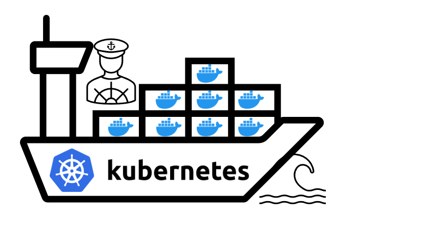

# PROJECT-21
## **Orchestrating containers across multiple Virtual Servers with Kubernetes. Part 1**


- In previous Project 20 you have started to work with containerization and have learned how to prepare and deploy a Docker container using Docker Compose.

- In this project, you will continue building upon your containerization skills, and begin to work on industry tools that fit for production deployment.

- Containers are the most lightweight and easily transferrable workloads, they start faster than VMs, consume less space and memory and, they perfectly fit to accommodate microservice architecture. It means that number of containers will be usually significantly higher that number of VMs and with number comes complexity of managing containers.

- To manage a fleet of containers you can use different software solutions, but the most widely used one is [Kubernetes](https://kubernetes.io/) (also referred as K8s). It was originally developed by Google and now being maintained by [Cloud Native Computing Foundation (CNCF)](https://en.wikipedia.org/wiki/Cloud_Native_Computing_Foundation).

- Why has it become so popular? It is a powerful Swiss-army knife when it comes to managing multiple containers in production-grade solutions.

- For now we will not list down all the features and benefits of Kubernetes, you can watch [this overview video](https://www.youtube.com/watch?v=VnvRFRk_51k) to get to know more, but you certainly must have this tool in your DevOps arsenal and know when and how to use if for production-grade deployments.

- This project is the first of a series Kubernetes-related practice projects, so get ready to become a professional containers' fleet "pilot"*.

- *Kubernetes (κυβερνήτης, Greek for "helmsman" or "pilot" or "governor", and the etymological root of cybernetics)




### Why migrate from Docker Compose to K8s

- In the previous project you successfully deployed your Docker containers using **Docker Compose**, it is a great tool that helps avoiding execution of multiple CLI commands by preparing a declarative configuration file. It is handy when you deploy one or a few containers, but in most cases, it does not fit for production deployments.

- Because of the many limitations that Docker Compose has, it is very important for us to consider migrating our solution to more an advanced technology. The most common alternatives to **Compose**, amongst a few others, are **Docker Swarm** and **Kubernetes**.

### What is wrong with Docker Compose?

- It is important to understand that, DevOps is about "Culture" and NOT "Tools" Therefore, it is not correct to say that one tool is better than another; different organizations have different needs and a good tool for one team may be bad for another just because their needs are not the same. In some teams, Docker Compose fit their needs perfectly, despite the perceived limitations. The major limitation of Docker Compose is that it can only be used to run workloads on a single computer host. Now, that is an obvious limitation because if our **Tooling Application** and its **MySQL Database** are all running on a single VM, like we did in Project 20, then this host is considered as a **SPOF** (i.e. - Single Point Of Failure).

- So, could we say there is something wrong with Docker Compose? Not exactly, as a matter of fact, it is being used a lot in the industry. It fits well into some use cases that require speedy development and Proof of Concepts. As you will soon see, Kubernetes is a lot more complex technology, and it may be an overkill for some use cases.


### Container Orchestration with Kubernetes

**What is Container Orchestration?**

- Two important things to remember about Docker containers are:

1. Unlike virtual machines, they are not designed to run for a very long time. By design, Docker containers are ephemeral. By “ephemeral” it means that a container can be stopped and destroyed, and a new one can be built from the same Docker image and put in place with an absolute minimum set-up and configuration requirement.

2. To ensure that container workloads are highly scalable, they must be configured to run across multiple compute nodes. A compute node can be a physical server or a virtual machine with Docker engine installed to run your containers.

- If we had two compute nodes to run our containers, let us consider a following scenarios:

1. Given the two points mentioned above, if containers are configured to run across 2 computer nodes, and a particular container, running on Node 1 dies, how will it know that it can spin up again on Node 2?

2. Let us imagine that Tooling website container is running on Node 1, and MySQL container is running on Node 2, how will both containers be able to communicate with each other? Remember in Project 20, we had to create a custom network on the same host and ensure that they can communicate through that network. But in the case of 2 separate hosts, this is natively not possible.

**Container orchestration** is a concept that allows to address these two scenarios, it provides automation of all the aspects of coordinating and managing containers. Container orchestration is focused on managing life cycle of containers and their dynamic environments.

- It is about automating the entire lifecycle of containers running across multiple nodes:

  - Configuring and scheduling of containers on nodes

  - Ensuring the availability of containers, even when they die

  - Scaling of containers to equally balance application workloads across infrastructure

  - Allocation of resources between containers

  - Load balancing, traffic routing and service discovery of containers

  - Health monitoring of containers

  - Securing the interactions between containers.

- Kubernetes is a tool designed to do Container Orchestration and it does its job very well when correctly configured.

- As mentioned earlier, there are other alternatives to Docker Compose. But, throughout the entire PBL program, we will not focus on **Docker Swarm**. We will rather spend more time with **Kubernetes**. Part of the reason for this is because Kubernetes has more functionalities and is widely in use in the industry.

- To know when to choose between  Docker Swarm and Kubernetes, [Here is an interesting article to read](https://dzone.com/articles/quotdocker-swarm-or-kubernetesquot-is-it-the-right) with some very enlightening stats.

**Kubernetes architecture**

- Kubernetes is a not a single package application that you can install with one command, it is comprised of several components, some of them can be deployed as services, some can be also deployed as separate containers.

- Let us take a look at Kubernetes architecture diagram below:

 


- Read about every component in the [official documentation](https://kubernetes.io/docs/concepts/overview/components/).
Make sure you understand the role of each component on the diagram above, without this understanding it will be extremely difficult for you to install and operate a K8s cluster, especially when it comes to troubleshooting and maintenance.

- As an IT professional in general, you shall be comfortable using official documentation for tools you use, in case of Kubernetes - it has a very well structured and comprehensive documentation portal with multiple configuration code snippets. We strongly encourage you to add it to your bookmarks and refer to it every time you have a K8s-related question.


**"Kubernetes From-Ground-Up"**

- ***K8s installation options***

- So far, Kubernetes sounds like a lot of fun, right? With its intuitive architecture, and rich configuration options, you may already want to jump right in, spin up a few VMs and begin to install and configure a Kubernetes cluster. But hold on for a second. Installing and configuring Kubernetes is far from being a walk in the park, i.e., it is very difficult to implement and get it ready for production. Especially, if you want to setup a highly available, and secure Kubernetes cluster.

- The good news is, there are open-source tools available today that already has all the hard work done and you can plug into them easily. An example of that is **minikube**, which can be used during testing and development.

- For a better understanding of each aspect of spinning up a Kubernetes cluster, we will do it without any automated helpers. You will install each and every component manually from scratch and learn how to make them work together - we call this approach "K8s From-Ground-Up".

- To successfully implement "K8s From-Ground-Up", the following and even more will be done by you as a K8s administrator:

1. Install and configure [master (also known as control plane) components](https://kubernetes.io/docs/concepts/overview/components/#control-plane-components) and [worker nodes (or just nodes)](https://kubernetes.io/docs/concepts/architecture/nodes/).

2. Apply security settings across the entire cluster (i.e., encrypting the data in transit, and at rest)

    - In transit encryption means encrypting communications over the network using HTTPS

    - At rest encryption means encrypting the data stored on a disk

3. Plan the capacity for the backend data store etcd

4. Configure network plugins for the containers to communicate

5. Manage periodical upgrade of the cluster

6. Configure observability and auditing

**Note**: Unless you have any business or compliance restrictions, **ALWAYS** consider to use managed versions of K8s - Platform as a Service offerings, such as [Azure Kubernetes Service (AKS)](https://learn.microsoft.com/en-us/azure/aks/), [Amazon Elastic Kubernetes Service (Amazon EKS)](https://aws.amazon.com/eks/), or [Google Kubernetes Engine (GKE)](https://cloud.google.com/kubernetes-engine) as they usually have better default security settings, and the costs for maintaining the control plane are very low.

- You will be able to appreciate automation tools and managed versions of Kubernetes much more after you have experienced all the lessons from the struggles and failures from the **"K8s From-Ground-Up"**.

**Let us begin building out Kubernetes cluster from the ground**

- DISCLAIMER: The following setup of Kubernetes should be used for learning purpose only, and not to be considered for production. This is because setting up a K8s cluster for production use has a lot more moving parts, especially when it comes to planning the nodes, and securing the cluster. The purpose of "K8s From-Ground-Up" is to get you much closer to the different components as shown in the architecture diagram and relate with what you have been learning about Kubernetes.

**Tools to be used and expected result of the Project 21**

  - VM: AWS EC2
  - OS: Ubuntu 20.04 lts+
  - Docker Engine
  - kubectl console utility
  - cfssl and cfssljson utilities
  - Kubernetes cluster

- You will create 6 EC2 Instances, and in the end, we will have the following parts of the cluster properly configured:

  - Three Kubernetes Master
  - Three Kubernetes Worker Nodes
  - Configured SSL/TLS certificates for Kubernetes components to communicate securely
  - Configured Node Network
  - Configured Pod Network


**Step 0 Install client tools before bootstrapping the cluster.**

- First, you will need some client tools installed and configurations made on your client workstation:

  - [awscli](https://aws.amazon.com/cli/) - is a unified tool to manage your AWS services

  - [kubectl](https://kubernetes.io/docs/reference/kubectl/) - this command line utility will be your main control tool to manage your K8s cluster. You will use this tool so many times, so you will be able to type 'kubetcl' on your keyboard with a speed of light. You can always make a shortcut (alias) to just one character 'k'. Also, add this extremely useful official kubectl Cheat Sheet to your bookmarks, it has examples of the most used 'kubectl' commands.

  - [cfssl](https://blog.cloudflare.com/introducing-cfssl/) - an open source toolkit for everything TLS/SSL from [Cloudflare](https://www.cloudflare.com/)


  - [cfssljson](https://github.com/cloudflare/cfssl) - a program, which takes the JSON output from the cfssl and writes certificates, keys, [CSRs](https://en.wikipedia.org/wiki/Certificate_signing_request), and bundles to disk.


**Install and configure AWS CLI**

- On your local workstation (wsl ubuntu 20.04) download and install the latest version of AWS CLI

- To install awscli on your ubuntu local system:

```
sudo apt update
sudo apt install awscli -y
sudo apt install jq -y
```


- Configure AWS CLI to access all AWS services used, for this you need to have a user with programmatic access keys configured in AWS Identity and Access Management (IAM).

- Generate access keys and store them in a safe place.

- To configure your AWS CLI – run your shell (or cmd if using Windows) and run:

`aws configure`

- Test your AWS CLI by running:

`aws ec2 describe-vpcs` and check if you can see VPC details.


**Install kubectl**

- Kubernetes cluster has a Web API that can receive HTTP/HTTPS requests, but it is quite cumbersome to ***curl*** an API each and every time you need to send some command, so ***kubectl*** command tool was developed to ease a K8s administrator's life.

- With this tool you can easily interact with Kubernetes to deploy applications, inspect and manage cluster resources, view logs and perform many more administrative operations.

- Because I had already installed on my windows system, my wsl ubuntu can pick it up and I dont need to install it again on the ubuntu.

**Installing kubectl**

- Linux Or Windows using Gitbash or similar tool

- Download the binary

```
wget https://storage.googleapis.com/kubernetes-release/release/v1.21.0/bin/linux/amd64/kubectl
```

- Make it executable

```
chmod +x kubectl
```

- Move to the Bin directory

```
sudo mv kubectl /usr/local/bin/
```

- Verify that kubectl version 1.21.0 or higher is installed:

```
kubectl version --client
```

- Output:

```
    Client Version: version.Info{Major:"1", Minor:"20+", GitVersion:"v1.20.4-dirty", GitCommit:"e87da0bd6e03ec3fea7933c4b5263d151aafd07c", GitTreeState:"dirty", BuildDate:"2021-03-15T10:03:32Z", GoVersion:"go1.16.2", Compiler:"gc", Platform:"darwin/amd64"}
```


**Install CFSSL and CFSSLJSON-linux**

- cfssl is an open source tool by Cloudflare used to setup a Public Key Infrastructure (PKI Infrastructure) for generating, signing and bundling TLS certificates. In previous projects you have experienced the use of Letsencrypt for the similar use case. Here, cfssl will be configured as a Certificate Authority which will issue the certificates required to spin up a Kubernetes cluster.

- Download, install and verify successful installation of cfssl and cfssljson:

```
$ wget -q --show-progress --https-only --timestamping
```
```
https://github.com/cloudflare/cfssl/releases/download/v1.6.5/cfssl_1.6.5_linux_amd64
```
```
https://github.com/cloudflare/cfssl/releases/download/v1.6.5/cfssljson_1.6.5_linux_amd64
```

```
$ chmod +x cfssl_1.6.5_linux_amd64 cfssljson_1.6.5_linux_amd64
```
```
$ sudo mv cfssl_1.6.5_linux_amd64 /usr/local/bin/cfssl
```
```
$ sudo mv cfssljson_1.6.5_linux_amd64 /usr/local/bin/cfssljson
```

- Verification. Verify cfssl version 1.2.0 or higher is installed:

```
cfssl version
```

```
Version: 1.2.0
Revision: dev
Runtime: go1.6
```

```
cfssljson --version
```

```
Version: 1.4.1
Runtime: go1.12.12
```


