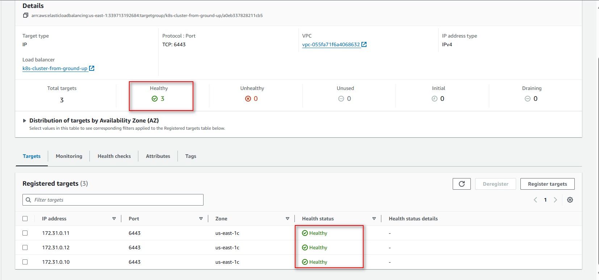

# PROJECT-21
## **Orchestrating containers across multiple Virtual Servers with Kubernetes. Part 1**


- In previous Project 20 you have started to work with containerization and have learned how to prepare and deploy a Docker container using Docker Compose.

- In this project, you will continue building upon your containerization skills, and begin to work on industry tools that fit for production deployment.

- Containers are the most lightweight and easily transferrable workloads, they start faster than VMs, consume less space and memory and, they perfectly fit to accommodate microservice architecture. It means that number of containers will be usually significantly higher that number of VMs and with number comes complexity of managing containers.

- To manage a fleet of containers you can use different software solutions, but the most widely used one is [Kubernetes](https://kubernetes.io/) (also referred as K8s). It was originally developed by Google and now being maintained by [Cloud Native Computing Foundation (CNCF)](https://en.wikipedia.org/wiki/Cloud_Native_Computing_Foundation).

- Why has it become so popular? It is a powerful Swiss-army knife when it comes to managing multiple containers in production-grade solutions.

- For now we will not list down all the features and benefits of Kubernetes, you can watch [this overview video](https://www.youtube.com/watch?v=VnvRFRk_51k) to get to know more, but you certainly must have this tool in your DevOps arsenal and know when and how to use if for production-grade deployments.

- This project is the first of a series Kubernetes-related practice projects, so get ready to become a professional containers' fleet "pilot"*.

- *Kubernetes (κυβερνήτης, Greek for "helmsman" or "pilot" or "governor", and the etymological root of cybernetics)


### Why migrate from Docker Compose to K8s

- In the previous project you successfully deployed your Docker containers using **Docker Compose**, it is a great tool that helps avoiding execution of multiple CLI commands by preparing a declarative configuration file. It is handy when you deploy one or a few containers, but in most cases, it does not fit for production deployments.

- Because of the many limitations that Docker Compose has, it is very important for us to consider migrating our solution to more an advanced technology. The most common alternatives to **Compose**, amongst a few others, are **Docker Swarm** and **Kubernetes**.

### What is wrong with Docker Compose?

- It is important to understand that, DevOps is about "Culture" and NOT "Tools" Therefore, it is not correct to say that one tool is better than another; different organizations have different needs and a good tool for one team may be bad for another just because their needs are not the same. In some teams, Docker Compose fit their needs perfectly, despite the perceived limitations. The major limitation of Docker Compose is that it can only be used to run workloads on a single computer host. Now, that is an obvious limitation because if our **Tooling Application** and its **MySQL Database** are all running on a single VM, like we did in Project 20, then this host is considered as a **SPOF** (i.e. - Single Point Of Failure).

- So, could we say there is something wrong with Docker Compose? Not exactly, as a matter of fact, it is being used a lot in the industry. It fits well into some use cases that require speedy development and Proof of Concepts. As you will soon see, Kubernetes is a lot more complex technology, and it may be an overkill for some use cases.


### Container Orchestration with Kubernetes

**What is Container Orchestration?**

- Two important things to remember about Docker containers are:

1. Unlike virtual machines, they are not designed to run for a very long time. By design, Docker containers are ephemeral. By “ephemeral” it means that a container can be stopped and destroyed, and a new one can be built from the same Docker image and put in place with an absolute minimum set-up and configuration requirement.

2. To ensure that container workloads are highly scalable, they must be configured to run across multiple compute nodes. A compute node can be a physical server or a virtual machine with Docker engine installed to run your containers.

- If we had two compute nodes to run our containers, let us consider a following scenarios:

1. Given the two points mentioned above, if containers are configured to run across 2 computer nodes, and a particular container, running on Node 1 dies, how will it know that it can spin up again on Node 2?

2. Let us imagine that Tooling website container is running on Node 1, and MySQL container is running on Node 2, how will both containers be able to communicate with each other? Remember in Project 20, we had to create a custom network on the same host and ensure that they can communicate through that network. But in the case of 2 separate hosts, this is natively not possible.

**Container orchestration** is a concept that allows to address these two scenarios, it provides automation of all the aspects of coordinating and managing containers. Container orchestration is focused on managing life cycle of containers and their dynamic environments.

- It is about automating the entire lifecycle of containers running across multiple nodes:

  - Configuring and scheduling of containers on nodes

  - Ensuring the availability of containers, even when they die

  - Scaling of containers to equally balance application workloads across infrastructure

  - Allocation of resources between containers

  - Load balancing, traffic routing and service discovery of containers

  - Health monitoring of containers

  - Securing the interactions between containers.

- Kubernetes is a tool designed to do Container Orchestration and it does its job very well when correctly configured.

- As mentioned earlier, there are other alternatives to Docker Compose. But, throughout the entire PBL program, we will not focus on **Docker Swarm**. We will rather spend more time with **Kubernetes**. Part of the reason for this is because Kubernetes has more functionalities and is widely in use in the industry.

- To know when to choose between  Docker Swarm and Kubernetes, [Here is an interesting article to read](https://dzone.com/articles/quotdocker-swarm-or-kubernetesquot-is-it-the-right) with some very enlightening stats.

**Kubernetes architecture**

- Kubernetes is a not a single package application that you can install with one command, it is comprised of several components, some of them can be deployed as services, some can be also deployed as separate containers.

- Let us take a look at Kubernetes architecture diagram below:

 


- Read about every component in the [official documentation](https://kubernetes.io/docs/concepts/overview/components/).
Make sure you understand the role of each component on the diagram above, without this understanding it will be extremely difficult for you to install and operate a K8s cluster, especially when it comes to troubleshooting and maintenance.

- As an IT professional in general, you shall be comfortable using official documentation for tools you use, in case of Kubernetes - it has a very well structured and comprehensive documentation portal with multiple configuration code snippets. We strongly encourage you to add it to your bookmarks and refer to it every time you have a K8s-related question.


**"Kubernetes From-Ground-Up"**

- ***K8s installation options***

- So far, Kubernetes sounds like a lot of fun, right? With its intuitive architecture, and rich configuration options, you may already want to jump right in, spin up a few VMs and begin to install and configure a Kubernetes cluster. But hold on for a second. Installing and configuring Kubernetes is far from being a walk in the park, i.e., it is very difficult to implement and get it ready for production. Especially, if you want to setup a highly available, and secure Kubernetes cluster.

- The good news is, there are open-source tools available today that already has all the hard work done and you can plug into them easily. An example of that is **minikube**, which can be used during testing and development.

- For a better understanding of each aspect of spinning up a Kubernetes cluster, we will do it without any automated helpers. You will install each and every component manually from scratch and learn how to make them work together - we call this approach "K8s From-Ground-Up".

- To successfully implement "K8s From-Ground-Up", the following and even more will be done by you as a K8s administrator:

1. Install and configure [master (also known as control plane) components](https://kubernetes.io/docs/concepts/overview/components/#control-plane-components) and [worker nodes (or just nodes)](https://kubernetes.io/docs/concepts/architecture/nodes/).

2. Apply security settings across the entire cluster (i.e., encrypting the data in transit, and at rest)

    - In transit encryption means encrypting communications over the network using HTTPS

    - At rest encryption means encrypting the data stored on a disk

3. Plan the capacity for the backend data store etcd

4. Configure network plugins for the containers to communicate

5. Manage periodical upgrade of the cluster

6. Configure observability and auditing

**Note**: Unless you have any business or compliance restrictions, **ALWAYS** consider to use managed versions of K8s - Platform as a Service offerings, such as [Azure Kubernetes Service (AKS)](https://learn.microsoft.com/en-us/azure/aks/), [Amazon Elastic Kubernetes Service (Amazon EKS)](https://aws.amazon.com/eks/), or [Google Kubernetes Engine (GKE)](https://cloud.google.com/kubernetes-engine) as they usually have better default security settings, and the costs for maintaining the control plane are very low.

- You will be able to appreciate automation tools and managed versions of Kubernetes much more after you have experienced all the lessons from the struggles and failures from the **"K8s From-Ground-Up"**.

**Let us begin building out Kubernetes cluster from the ground**

- DISCLAIMER: The following setup of Kubernetes should be used for learning purpose only, and not to be considered for production. This is because setting up a K8s cluster for production use has a lot more moving parts, especially when it comes to planning the nodes, and securing the cluster. The purpose of "K8s From-Ground-Up" is to get you much closer to the different components as shown in the architecture diagram and relate with what you have been learning about Kubernetes.

**Tools to be used and expected result of the Project 21**

  - VM: AWS EC2
  - OS: Ubuntu 20.04 lts+
  - Docker Engine
  - kubectl console utility
  - cfssl and cfssljson utilities
  - Kubernetes cluster

- You will create 6 EC2 Instances, and in the end, we will have the following parts of the cluster properly configured:

  - Three Kubernetes Master
  - Three Kubernetes Worker Nodes
  - Configured SSL/TLS certificates for Kubernetes components to communicate securely
  - Configured Node Network
  - Configured Pod Network


**Step 0 Install client tools before bootstrapping the cluster.**

- First, you will need some client tools installed and configurations made on your client workstation:

  - [awscli](https://aws.amazon.com/cli/) - is a unified tool to manage your AWS services

  - [kubectl](https://kubernetes.io/docs/reference/kubectl/) - this command line utility will be your main control tool to manage your K8s cluster. You will use this tool so many times, so you will be able to type 'kubetcl' on your keyboard with a speed of light. You can always make a shortcut (alias) to just one character 'k'. Also, add this extremely useful official kubectl Cheat Sheet to your bookmarks, it has examples of the most used 'kubectl' commands.

  - [cfssl](https://blog.cloudflare.com/introducing-cfssl/) - an open source toolkit for everything TLS/SSL from [Cloudflare](https://www.cloudflare.com/)


  - [cfssljson](https://github.com/cloudflare/cfssl) - a program, which takes the JSON output from the cfssl and writes certificates, keys, [CSRs](https://en.wikipedia.org/wiki/Certificate_signing_request), and bundles to disk.


**Install and configure AWS CLI**

- On your local workstation (wsl ubuntu 20.04) download and install the latest version of AWS CLI

- To install awscli on your ubuntu local system:

```
sudo apt update
sudo apt install awscli -y
sudo apt install jq -y
```


- Configure AWS CLI to access all AWS services used, for this you need to have a user with programmatic access keys configured in AWS Identity and Access Management (IAM).

- Generate access keys and store them in a safe place.

- To configure your AWS CLI – run your shell (or cmd if using Windows) and run:

`aws configure`

- Test your AWS CLI by running:

`aws ec2 describe-vpcs` and check if you can see VPC details.


**Install kubectl**

- Kubernetes cluster has a Web API that can receive HTTP/HTTPS requests, but it is quite cumbersome to ***curl*** an API each and every time you need to send some command, so ***kubectl*** command tool was developed to ease a K8s administrator's life.

- With this tool you can easily interact with Kubernetes to deploy applications, inspect and manage cluster resources, view logs and perform many more administrative operations.

- Because I had already installed on my windows system, my wsl ubuntu can pick it up and I dont need to install it again on the ubuntu.

**Installing kubectl**

- Linux Or Windows using Gitbash or similar tool

- Download the binary

```
wget https://storage.googleapis.com/kubernetes-release/release/v1.21.0/bin/linux/amd64/kubectl
```

- Make it executable

```
chmod +x kubectl
```

- Move to the Bin directory

```
sudo mv kubectl /usr/local/bin/
```

- Verify that kubectl version 1.21.0 or higher is installed:

```
kubectl version --client
```

- Output:

```
    Client Version: version.Info{Major:"1", Minor:"20+", GitVersion:"v1.20.4-dirty", GitCommit:"e87da0bd6e03ec3fea7933c4b5263d151aafd07c", GitTreeState:"dirty", BuildDate:"2021-03-15T10:03:32Z", GoVersion:"go1.16.2", Compiler:"gc", Platform:"darwin/amd64"}
```


**Install CFSSL and CFSSLJSON-linux**

- cfssl is an open source tool by **Cloudflare** used to setup a **Public Key Infrastructure** [(PKI Infrastructure)](https://en.wikipedia.org/wiki/Public_key_infrastructure) for generating, signing and bundling TLS certificates. In previous projects you have experienced the use of **Letsencrypt** for the similar use case. Here, cfssl will be configured as a Certificate Authority which will issue the certificates required to spin up a Kubernetes cluster.

- Download, install and verify successful installation of cfssl and cfssljson:

```
$ wget -q --show-progress --https-only --timestamping
```
```
https://github.com/cloudflare/cfssl/releases/download/v1.6.5/cfssl_1.6.5_linux_amd64
```
```
https://github.com/cloudflare/cfssl/releases/download/v1.6.5/cfssljson_1.6.5_linux_amd64
```

```
$ chmod +x cfssl_1.6.5_linux_amd64 cfssljson_1.6.5_linux_amd64
```
```
$ sudo mv cfssl_1.6.5_linux_amd64 /usr/local/bin/cfssl
```
```
$ sudo mv cfssljson_1.6.5_linux_amd64 /usr/local/bin/cfssljson
```

- Verification. Verify cfssl version 1.2.0 or higher is installed:

```
cfssl version
```

- Output

```
Version: 1.2.0
Revision: dev
Runtime: go1.6
```

```
cfssljson --version
```

- Output 

```
Version: 1.4.1
Runtime: go1.12.12
```


## AWS CLOUD RESOURCES FOR KUBERNETES CLUSTER

- As we already know, we need some machines to run the control plane and the worker nodes. In this section, you will provision EC2 Instances required to run your K8s cluster. You can use Terraform for this. But it is highly recommended to start out first with manual provisioning using **awscli** and have thorough knowledge about the whole setup. After that, you can destroy the entire project and start all over again using Terraform. This manual approach will solidify your skills and give you the opportunity to face more challenges.


### Step 1 – Configure Network Infrastructure

**Virtual Private Cloud – VPC**

1. Create a directory named k8s-cluster-from-ground-up

```
mkdir k8s-cluster-from-ground-up
```

2. Create a VPC and store the ID as a variable:

```
VPC_ID=$(aws ec2 create-vpc \
--cidr-block 172.31.0.0/16 \
--output text --query 'Vpc.VpcId'
)
```

3. Tag the VPC so that it is named:

```
NAME=k8s-cluster-from-ground-up
```

```
aws ec2 create-tags \
  --resources ${VPC_ID} \
  --tags Key=Name,Value=${NAME}
```


**Domain Name System – DNS**

4. Enable DNS support for your VPC:

```
aws ec2 modify-vpc-attribute \
--vpc-id ${VPC_ID} \
--enable-dns-support '{"Value": true}'
```

5. Enable DNS support for hostnames:

```
aws ec2 modify-vpc-attribute \
--vpc-id ${VPC_ID} \
--enable-dns-hostnames '{"Value": true}'
```


**AWS Region**

6. Set the required region

```
AWS_REGION=us-east-1
```


**Dynamic Host Configuration Protocol – DHCP**

7. Configure DHCP Options Set:

- Dynamic Host Configuration Protocol (DHCP) is a network management protocol used on Internet Protocol networks for automatically assigning IP addresses and other communication parameters to devices connected to the network using a client–server architecture.

- AWS automatically creates and associates a DHCP option set for your Amazon VPC upon creation and sets two options: domain-name-servers (defaults to AmazonProvidedDNS) and domain-name (defaults to the domain name for your set region). AmazonProvidedDNS is an Amazon Domain Name System (DNS) server, and this option enables DNS for instances to communicate using DNS names.

- By default EC2 instances have fully qualified names like ip-172-50-197-106.eu-central-1.compute.internal. But you can set your own configuration using an example below.

```
DHCP_OPTION_SET_ID=$(aws ec2 create-dhcp-options \
  --dhcp-configuration \
    "Key=domain-name,Values=$AWS_REGION.compute.internal" \
    "Key=domain-name-servers,Values=AmazonProvidedDNS" \
  --output text --query 'DhcpOptions.DhcpOptionsId')
```

8. Tag the DHCP Option set:

```
aws ec2 create-tags \
  --resources ${DHCP_OPTION_SET_ID} \
  --tags Key=Name,Value=${NAME}
```

9. Associate the DHCP Option set with the VPC:

```
aws ec2 associate-dhcp-options \
  --dhcp-options-id ${DHCP_OPTION_SET_ID} \
  --vpc-id ${VPC_ID}
```  


**Subnet**

10. Create the Subnet:

```
SUBNET_ID=$(aws ec2 create-subnet \
  --vpc-id ${VPC_ID} \
  --cidr-block 172.31.0.0/24 \
  --output text --query 'Subnet.SubnetId')
```

```
aws ec2 create-tags \
  --resources ${SUBNET_ID} \
  --tags Key=Name,Value=${NAME}
```


**Internet Gateway – IGW**

11. Create the Internet Gateway and attach it to the VPC:

```
INTERNET_GATEWAY_ID=$(aws ec2 create-internet-gateway \
  --output text --query 'InternetGateway.InternetGatewayId')
aws ec2 create-tags \
  --resources ${INTERNET_GATEWAY_ID} \
  --tags Key=Name,Value=${NAME}
```

```
aws ec2 attach-internet-gateway \
  --internet-gateway-id ${INTERNET_GATEWAY_ID} \
  --vpc-id ${VPC_ID}
```


**Route tables**

12. Create route tables, associate the route table to subnet, and create a route to allow external traffic to the Internet through the Internet Gateway:

```
ROUTE_TABLE_ID=$(aws ec2 create-route-table \
  --vpc-id ${VPC_ID} \
  --output text --query 'RouteTable.RouteTableId')
aws ec2 create-tags \
  --resources ${ROUTE_TABLE_ID} \
  --tags Key=Name,Value=${NAME}
aws ec2 associate-route-table \
  --route-table-id ${ROUTE_TABLE_ID} \
  --subnet-id ${SUBNET_ID}
aws ec2 create-route \
  --route-table-id ${ROUTE_TABLE_ID} \
  --destination-cidr-block 0.0.0.0/0 \
  --gateway-id ${INTERNET_GATEWAY_ID}
```

- **OUTPUT**:

```
{
    "AssociationId": "rtbassoc-07a8877e92504def7",
    "AssociationState": {
        "State": "associated"
    }
}
{
    "Return": true
}
```


**SECURITY GROUPS**

13. Configure security groups

```
# Create the security group and store its ID in a variable
SECURITY_GROUP_ID=$(aws ec2 create-security-group \
  --group-name ${NAME} \
  --description "Kubernetes cluster security group" \
  --vpc-id ${VPC_ID} \
  --output text --query 'GroupId')

# Create the NAME tag for the security group
aws ec2 create-tags \
  --resources ${SECURITY_GROUP_ID} \
  --tags Key=Name,Value=${NAME}

# Create Inbound traffic for all communication within the subnet to connect on ports used by the master node(s)
aws ec2 authorize-security-group-ingress \
    --group-id ${SECURITY_GROUP_ID} \
    --ip-permissions IpProtocol=tcp,FromPort=2379,ToPort=2380,IpRanges='[{CidrIp=172.31.0.0/24}]'

# Create Inbound traffic for all communication within the subnet to connect on ports used by the worker nodes
aws ec2 authorize-security-group-ingress \
    --group-id ${SECURITY_GROUP_ID} \
    --ip-permissions IpProtocol=tcp,FromPort=30000,ToPort=32767,IpRanges='[{CidrIp=172.31.0.0/24}]'

# Create inbound traffic to allow connections to the Kubernetes API Server listening on port 6443
aws ec2 authorize-security-group-ingress \
  --group-id ${SECURITY_GROUP_ID} \
  --protocol tcp \
  --port 6443 \
  --cidr 0.0.0.0/0

# Create Inbound traffic for SSH from anywhere (Do not do this in production. Limit access ONLY to IPs or CIDR that MUST connect)
aws ec2 authorize-security-group-ingress \
  --group-id ${SECURITY_GROUP_ID} \
  --protocol tcp \
  --port 22 \
  --cidr 0.0.0.0/0

# Create ICMP ingress for all types
aws ec2 authorize-security-group-ingress \
  --group-id ${SECURITY_GROUP_ID} \
  --protocol icmp \
  --port -1 \
  --cidr 0.0.0.0/0
```


**Network Load Balancer**

14. Create a network Load balancer

```
LOAD_BALANCER_ARN=$(aws elbv2 create-load-balancer \
--name ${NAME} \
--subnets ${SUBNET_ID} \
--scheme internet-facing \
--type network \
--output text --query 'LoadBalancers[].LoadBalancerArn')
```

**Tagret Group**

15. Create a target group: (For now it will be unhealthy because there are no real targets yet.)

```
TARGET_GROUP_ARN=$(aws elbv2 create-target-group \
  --name ${NAME} \
  --protocol TCP \
  --port 6443 \
  --vpc-id ${VPC_ID} \
  --target-type ip \
  --output text --query 'TargetGroups[].TargetGroupArn')
```

16. Register targets: (Just like above, no real targets. You will just put the IP addresses so that, when the nodes become available, they will be used as targets.)

```
aws elbv2 register-targets \
  --target-group-arn ${TARGET_GROUP_ARN} \
  --targets Id=172.31.0.1{0,1,2}
```

17. Create a listener to listen for requests and forward to the target nodes on TCP port 6443

```
aws elbv2 create-listener \
--load-balancer-arn ${LOAD_BALANCER_ARN} \
--protocol TCP \
--port 6443 \
--default-actions Type=forward,TargetGroupArn=${TARGET_GROUP_ARN} \
--output text --query 'Listeners[].ListenerArn'
```

**K8s Public Address**

18. Get the Kubernetes Public address

```
KUBERNETES_PUBLIC_ADDRESS=$(aws elbv2 describe-load-balancers \
--load-balancer-arns ${LOAD_BALANCER_ARN} \
--output text --query 'LoadBalancers[].DNSName')
```


### STEP 2 – CREATE COMPUTE RESOURCES

**AMI**

1. Get an image to create EC2 instances:

```
IMAGE_ID=$(aws ec2 describe-images --owners 099720109477 \
  --filters \
  'Name=root-device-type,Values=ebs' \
  'Name=architecture,Values=x86_64' \
  'Name=name,Values=ubuntu-pro-server/images/hvm-ssd/ubuntu-xenial-16.04-amd64-pro-server-20221202' \
  | jq -r '.Images|sort_by(.Name)[-1]|.ImageId')
```

- ubuntu/images/hvm-ssd/ubuntu-xenial-16.04-amd64-server-*

- ubuntu-pro-server/images/hvm-ssd/ubuntu-xenial-16.04-amd64-pro-server-20221202

**SSH key-pair**

2. Create SSH Key-Pair

```
mkdir -p ssh

aws ec2 create-key-pair \
  --key-name ${NAME} \
  --output text --query 'KeyMaterial' \
  > ssh/${NAME}.id_rsa
chmod 600 ssh/${NAME}.id_rsa
```

**EC2 Instances for Controle Plane (Master Nodes)**

3. Create 3 Master nodes: **Note** – Using ***t2.micro*** instead of ***t2.small*** as t2.micro is covered by AWS free tier

```
for i in 0 1 2; do
  instance_id=$(aws ec2 run-instances \
    --associate-public-ip-address \
    --image-id ${IMAGE_ID} \
    --count 1 \
    --key-name ${NAME} \
    --security-group-ids ${SECURITY_GROUP_ID} \
    --instance-type t2.micro \
    --private-ip-address 172.31.0.1${i} \
    --user-data "name=master-${i}" \
    --subnet-id ${SUBNET_ID} \
    --output text --query 'Instances[].InstanceId')
  aws ec2 modify-instance-attribute \
    --instance-id ${instance_id} \
    --no-source-dest-check
  aws ec2 create-tags \
    --resources ${instance_id} \
    --tags "Key=Name,Value=${NAME}-master-${i}"
done
```

**EC2 Instances for Worker Nodes**

1. Create 3 worker nodes:

```
for i in 0 1 2; do
  instance_id=$(aws ec2 run-instances \
    --associate-public-ip-address \
    --image-id ${IMAGE_ID} \
    --count 1 \
    --key-name ${NAME} \
    --security-group-ids ${SECURITY_GROUP_ID} \
    --instance-type t2.micro \
    --private-ip-address 172.31.0.2${i} \
    --user-data "name=worker-${i}|pod-cidr=172.20.${i}.0/24" \
    --subnet-id ${SUBNET_ID} \
    --output text --query 'Instances[].InstanceId')
  aws ec2 modify-instance-attribute \
    --instance-id ${instance_id} \
    --no-source-dest-check
  aws ec2 create-tags \
    --resources ${instance_id} \
    --tags "Key=Name,Value=${NAME}-worker-${i}"
done
```


### STEP 3 PREPARE THE SELF-SIGNED CERTIFICATE AUTHORITY AND GENERATE TLS CERTIFICATES

- The following components running on the Master node will require TLS certificates.

  - kube-controller-manager
  - kube-scheduler
  - etcd
  - kube-apiserver

- The following components running on the Worker nodes will require TLS certificates.

  - kubelet
  - kube-proxy

- Therefore, you will provision a **PKI** (public key infrastructure) Infrastructure using ***cfssl*** which will have a Certificate Authority. The CA will then generate certificates for all the individual components.

**Self-Signed Root Certificate Authority (CA)**

- Here, you will provision a CA that will be used to sign additional TLS certificates.

- Create a directory and **cd** into it:

```
mkdir ca-authority && cd ca-authority
```

- Generate the CA configuration file, Root Certificate, and Private key:

```
{

cat > ca-config.json <<EOF
{
  "signing": {
    "default": {
      "expiry": "8760h"
    },
    "profiles": {
      "kubernetes": {
        "usages": ["signing", "key encipherment", "server auth", "client auth"],
        "expiry": "8760h"
      }
    }
  }
}
EOF

cat > ca-csr.json <<EOF
{
  "CN": "Kubernetes",
  "key": {
    "algo": "rsa",
    "size": 2048
  },
  "names": [
    {
      "C": "UK",
      "L": "England",
      "O": "Kubernetes",
      "OU": "lego-project",
      "ST": "London"
    }
  ]
}
EOF

cfssl gencert -initca ca-csr.json | cfssljson -bare ca

}
```

- **OUTPUT**

```
2021/05/16 20:18:44 [INFO] generating a new CA key and certificate from CSR
2021/05/16 20:18:44 [INFO] generate received request
2021/05/16 20:18:44 [INFO] received CSR
2021/05/16 20:18:44 [INFO] generating key: rsa-2048
2021/05/16 20:18:44 [INFO] encoded CSR
2021/05/16 20:18:44 [INFO] signed certificate with serial number 478642753175858256977534824638605235819766817855
```

.png>)


- The file defines the following:

```
CN – Common name for the authority

algo – the algorithm used for the certificates

size – algorithm size in bits

C – Country

L – Locality (city)

ST – State or province

O – Organization

OU – Organizational Unit
```

- List the directory to see the created files using `ls -ltr`


**The 3 important files here are:**

  - **ca.pem** – The Root Certificate
  - **ca-key.pem** – The Private Key
  - **ca.csr** – The Certificate Signing Request

**Generating TLS Certificates For Client and Server**

- You will need to provision Client/Server certificates for all the components. It is a ***MUST*** to have encrypted communication within the cluster. Therefore, the ***server*** here are the master nodes running the api-server component. While the client is every other component that needs to communicate with the api-server.

- Now we have a certificate for the Root CA, we can then begin to request more certificates which the different Kubernetes components, i.e. clients and server, will use to have encrypted communication.

- Remember, the clients here refer to every other component that will communicate with the ***api-server***. These are:

  - kube-controller-manager
  - kube-scheduler
  - etcd
  - kubelet
  - kube-proxy
  - Kubernetes Admin User

**Let us begin with the Kubernetes API-Server Certificate and Private Key**

- The certificate for the Api-server must have IP addresses, DNS names, and a Load Balancer address included. Otherwise, you will have a lot of difficulties connecting to the **api-server**.

1. Generate the **Certificate Signing Request (CSR), Private** Key and the **Certificate** for the Kubernetes Master Nodes.

```
{
cat > master-kubernetes-csr.json <<EOF
{
  "CN": "kubernetes",
   "hosts": [
   "127.0.0.1",
   "172.31.0.10",
   "172.31.0.11",
   "172.31.0.12",
   "ip-172-31-0-10",
   "ip-172-31-0-11",
   "ip-172-31-0-12",
   "ip-172-31-0-10.${AWS_REGION}.compute.internal",
   "ip-172-31-0-11.${AWS_REGION}.compute.internal",
   "ip-172-31-0-12.${AWS_REGION}.compute.internal",
   "${KUBERNETES_PUBLIC_ADDRESS}",
   "kubernetes",
   "kubernetes.default",
   "kubernetes.default.svc",
   "kubernetes.default.svc.cluster",
   "kubernetes.default.svc.cluster.local"
  ],
  "key": {
    "algo": "rsa",
    "size": 2048
  },
  "names": [
    {
      "C": "UK",
      "L": "England",
      "O": "Kubernetes",
      "OU": "lego-project",
      "ST": "London"
    }
  ]
}
EOF

cfssl gencert \
  -ca=ca.pem \
  -ca-key=ca-key.pem \
  -config=ca-config.json \
  -profile=kubernetes \
  master-kubernetes-csr.json | cfssljson -bare master-kubernetes
}
```

.png>)


**Creating the other certificates: for the following Kubernetes components:**

  - Scheduler Client Certificate
  - Kube Proxy Client Certificate
  - Controller Manager Client Certificate
  - Kubelet Client Certificates
  - K8s admin user Client Certificate

2. `kube-scheduler` Client Certificate and Private Key

```
{
cat > kube-scheduler-csr.json <<EOF
{
  "CN": "system:kube-scheduler",
  "key": {
    "algo": "rsa",
    "size": 2048
  },
  "names": [
    {
      "C": "UK",
      "L": "England",
      "O": "system:kube-scheduler",
      "OU": "lego-project",
      "ST": "London"
    }
  ]
}
EOF

cfssl gencert \
  -ca=ca.pem \
  -ca-key=ca-key.pem \
  -config=ca-config.json \
  -profile=kubernetes \
  kube-scheduler-csr.json | cfssljson -bare kube-scheduler

}
```


3.` kube-proxy` Client Certificate and Private Key

```
{

cat > kube-proxy-csr.json <<EOF
{
  "CN": "system:kube-proxy",
  "key": {
    "algo": "rsa",
    "size": 2048
  },
  "names": [
    {
      "C": "UK",
      "L": "England",
      "O": "system:node-proxier",
      "OU": "lego-project",
      "ST": "London"
    }
  ]
}
EOF

cfssl gencert \
  -ca=ca.pem \
  -ca-key=ca-key.pem \
  -config=ca-config.json \
  -profile=kubernetes \
  kube-proxy-csr.json | cfssljson -bare kube-proxy

}
```


4.` kube-controller-manager` Client Certificate and Private Key

```
{
cat > kube-controller-manager-csr.json <<EOF
{
  "CN": "system:kube-controller-manager",
  "key": {
    "algo": "rsa",
    "size": 2048
  },
  "names": [
    {
      "C": "UK",
      "L": "England",
      "O": "system:kube-controller-manager",
      "OU": "lego-project",
      "ST": "London"
    }
  ]
}
EOF

cfssl gencert \
  -ca=ca.pem \
  -ca-key=ca-key.pem \
  -config=ca-config.json \
  -profile=kubernetes \
  kube-controller-manager-csr.json | cfssljson -bare kube-controller-manager

}
```


5. `kubelet Client` Certificate and Private Key

Similar to how you configured the ***api-server's*** certificate, Kubernetes requires that the hostname of each worker node is included in the client certificate.

- Also, Kubernetes uses a special-purpose authorization mode called [Node Authorizer](https://kubernetes.io/docs/reference/access-authn-authz/node/), that specifically authorizes API requests made by kubelet services. In order to be authorized by the Node Authorizer, kubelets must use a credential that identifies them as being in the system:nodes **group**, with a username of system:node:<nodeName>. Notice the "CN": "system:node:${instance_hostname}", in the below code.

- Therefore, the certificate to be created must comply to these requirements. In the below example, there are 3 worker nodes, hence we will use bash to loop through a list of the worker nodes' hostnames, and based on each index, the respective Certificate Signing Request (CSR), private key and client certificates will be generated.

```
for i in 0 1 2; do
  instance="${NAME}-worker-${i}"
  instance_hostname="ip-172-31-0-2${i}"
  cat > ${instance}-csr.json <<EOF
{
  "CN": "system:node:${instance_hostname}",
  "key": {
    "algo": "rsa",
    "size": 2048
  },
  "names": [
    {
      "C": "UK",
      "L": "England",
      "O": "system:nodes",
      "OU": "lego-project",
      "ST": "London"
    }
  ]
}
EOF

  external_ip=$(aws ec2 describe-instances \
    --filters "Name=tag:Name,Values=${instance}" \
    --output text --query 'Reservations[].Instances[].PublicIpAddress')

  internal_ip=$(aws ec2 describe-instances \
    --filters "Name=tag:Name,Values=${instance}" \
    --output text --query 'Reservations[].Instances[].PrivateIpAddress')

  cfssl gencert \
    -ca=ca.pem \
    -ca-key=ca-key.pem \
    -config=ca-config.json \
    -hostname=${instance_hostname},${external_ip},${internal_ip} \
    -profile=kubernetes \
    ${NAME}-worker-${i}-csr.json | cfssljson -bare ${NAME}-worker-${i}
done
```


6. Finally, `kubernetes admin user's` Client Certificate and Private Key

```
{
cat > admin-csr.json <<EOF
{
  "CN": "admin",
  "key": {
    "algo": "rsa",
    "size": 2048
  },
  "names": [
    {
      "C": "UK",
      "L": "England",
      "O": "system:masters",
      "OU": "lego-project",
      "ST": "London"
    }
  ]
}
EOF

cfssl gencert \
  -ca=ca.pem \
  -ca-key=ca-key.pem \
  -config=ca-config.json \
  -profile=kubernetes \
  admin-csr.json | cfssljson -bare admin
}
```


7. **Actually, we are not done yet!** 😫

- There is one more pair of certificate and private key we need to generate. That is for the **Token Controller**: a part of the Kubernetes Controller Manager **kube-controller-manager** responsible for generating and signing service account tokens which are used by pods or other resources to establish connectivity to the ***api-server***. Read more about Service Accounts from the [official documentation](https://kubernetes.io/docs/reference/access-authn-authz/service-accounts-admin/).

- Alright, let us quickly create the last set of files, and we are done with PKIs

```
{

cat > service-account-csr.json <<EOF
{
  "CN": "service-accounts",
  "key": {
    "algo": "rsa",
    "size": 2048
  },
  "names": [
    {
      "C": "UK",
      "L": "England",
      "O": "Kubernetes",
      "OU": "lego-project",
      "ST": "London"
    }
  ]
}
EOF

cfssl gencert \
  -ca=ca.pem \
  -ca-key=ca-key.pem \
  -config=ca-config.json \
  -profile=kubernetes \
  service-account-csr.json | cfssljson -bare service-account
}
```


### Step 4 - Distributing the Client and Server Certificates

- Now it is time to start sending all the client and server certificates to their respective instances.

- Let us begin with the **worker nodes**:

- Copy these files securely to the worker nodes using scp utility

  - Root CA  certificate - **ca.pem**
  - X509 Certificate for each worker node
  - Private Key of the certificate for each worker node

- scp for securely transfer files from one machine to another has the same format as ssh command

```
ssh -i <path to private key pair> <host machine username>@<host IP>

scp -i <path to private key pair> file1 file2 file3 <host machine username>@<host IP>:~/;
```

- where ~/ is the choice directory where you want to send your files, in this case is the home directory

```
for i in 0 1 2; do
  instance="${NAME}-worker-${i}"
  external_ip=$(aws ec2 describe-instances \
    --filters "Name=tag:Name,Values=${instance}" \
    --output text --query 'Reservations[].Instances[].PublicIpAddress')
  scp -i ../ssh/${NAME}.id_rsa \
    ca.pem ${instance}-key.pem ${instance}.pem ubuntu@${external_ip}:~/; \
done
```

- **OUTPUT:**

```
    ca.pem ${instance}-key.pem ${instance}.pem ubuntu@${external_ip}:~/; \
done

ca.pem                                                                                                                                                                             100% 1350    48.2KB/s   00:00    
k8s-cluster-from-ground-up-worker-0-key.pem                                                                                                                                        100% 1675    52.5KB/s   00:00    
k8s-cluster-from-ground-up-worker-0.pem                                                                                                                                            100% 1594    48.9KB/s   00:00    
ca.pem                                                                                                                                                                             100% 1350    35.9KB/s   00:00    
k8s-cluster-from-ground-up-worker-1-key.pem                                                                                                                                        100% 1675    41.6KB/s   00:00    
k8s-cluster-from-ground-up-worker-1.pem                                                                                                                                            100% 1594    44.0KB/s   00:00    
ca.pem                                                                                                                                                                             100% 1350    44.7KB/s   00:00    
k8s-cluster-from-ground-up-worker-2-key.pem                                                                                                                                        100% 1679    49.2KB/s   00:00    
k8s-cluster-from-ground-up-worker-2.pem 
```

.png>)


**Master or Controller node: – Note that only the api-server related files will be sent over to the master nodes.**

```
for i in 0 1 2; do
instance="${NAME}-master-${i}" \
  external_ip=$(aws ec2 describe-instances \
    --filters "Name=tag:Name,Values=${instance}" \
    --output text --query 'Reservations[].Instances[].PublicIpAddress')
  scp -i ../ssh/${NAME}.id_rsa \
    ca.pem ca-key.pem service-account-key.pem service-account.pem \
    master-kubernetes.pem master-kubernetes-key.pem ubuntu@${external_ip}:~/;
done
```

- **OUTPUT:**

```
ca.pem                                                                                                                                                                             100% 1350     8.4KB/s   00:00    
ca-key.pem                                                                                                                                                                         100% 1675    44.7KB/s   00:00    
service-account-key.pem                                                                                                                                                            100% 1675    45.3KB/s   00:00    
service-account.pem                                                                                                                                                                100% 1440    42.0KB/s   00:00    
master-kubernetes.pem                                                                                                                                                              100% 1956    58.5KB/s   00:00    
master-kubernetes-key.pem                                                                                                                                                          100% 1671    47.5KB/s   00:00    
ca.pem                                                                                                                                                                             100% 1350    42.9KB/s   00:00    
ca-key.pem                                                                                                                                                                         100% 1675    46.3KB/s   00:00    
service-account-key.pem                                                                                                                                                            100% 1675    44.1KB/s   00:00    
service-account.pem                                                                                                                                                                100% 1440    46.9KB/s   00:00    
master-kubernetes.pem                                                                                                                                                              100% 1956    54.6KB/s   00:00    
master-kubernetes-key.pem                                                                                                                                                          100% 1671    48.7KB/s   00:00    
ca.pem                                                                                                                                                                             100% 1350    41.8KB/s   00:00    
ca-key.pem                                                                                                                                                                         100% 1675    45.4KB/s   00:00    
service-account-key.pem                                                                                                                                                            100% 1675    52.5KB/s   00:00    
service-account.pem                                                                                                                                                                100% 1440    45.6KB/s   00:00    
master-kubernetes.pem                                                                                                                                                              100% 1956    48.9KB/s   00:00    
master-kubernetes-key.pem
```

.png>)


- The `kube-proxy`, `kube-controller-manager`, `kube-scheduler`, and `kubelet` client certificates will be used to generate client authentication configuration files later.

### STEP 5 USE `KUBECTL` TO GENERATE KUBERNETES CONFIGURATION FILES FOR AUTHENTICATION

- All the work you are doing right now is ensuring that you do not face any difficulties by the time the Kubernetes cluster is up and running. In this step, you will create some files known as `kubeconfig`, which enables Kubernetes clients to locate and authenticate to the Kubernetes API Servers.

- You will need a client tool called `kubectl` to do this. And, by the way, most of your time with Kubernetes will be spent using `kubectl` commands.

- Now it's time to generate kubeconfig files for the `kubelet`, `controller manager`, `kube-proxy`, and `scheduler` clients and then the `admin` user.

- First, let us create a few environment variables for reuse by multiple commands.

```
KUBERNETES_API_SERVER_ADDRESS=$(aws elbv2 describe-load-balancers --load-balancer-arns ${LOAD_BALANCER_ARN} --output text --query 'LoadBalancers[].DNSName')
```

1. Generate the **kubelet** kubeconfig file

- For each of the nodes running the kubelet component, it is very important that the client certificate configured for that node is used to generate the kubeconfig. This is because each certificate has the node's DNS name or IP Address configured at the time the certificate was generated. It will also ensure that the appropriate authorization is applied to that node through the [Node Authorizer](https://kubernetes.io/docs/reference/access-authn-authz/node/)

- Below command must be run in the directory where all the certificates were generated.

```
for i in 0 1 2; do

instance="${NAME}-worker-${i}"
instance_hostname="ip-172-31-0-2${i}"

 # Set the kubernetes cluster in the kubeconfig file
  kubectl config set-cluster ${NAME} \
    --certificate-authority=ca.pem \
    --embed-certs=true \
    --server=https://$KUBERNETES_API_SERVER_ADDRESS:6443 \
    --kubeconfig=${instance}.kubeconfig

# Set the cluster credentials in the kubeconfig file
  kubectl config set-credentials system:node:${instance_hostname} \
    --client-certificate=${instance}.pem \
    --client-key=${instance}-key.pem \
    --embed-certs=true \
    --kubeconfig=${instance}.kubeconfig

# Set the context in the kubeconfig file
  kubectl config set-context default \
    --cluster=${NAME} \
    --user=system:node:${instance_hostname} \
    --kubeconfig=${instance}.kubeconfig

  kubectl config use-context default --kubeconfig=${instance}.kubeconfig
done
```

- **OUTPUT**: 

```
Cluster "k8s-cluster-from-ground-up" set.

User "system:node:ip-172-31-0-20.us-east-1.compute.internal" set.

Context "default" created.

Switched to context "default".

Cluster "k8s-cluster-from-ground-up" set.

User "system:node:ip-172-31-0-21.eu-central-1.compute.internal" set.

Context "default" created.

Switched to context "default".

Cluster "k8s-cluster-from-ground-up" set.

User "system:node:ip-172-31-0-22.us-east-1.compute.internal" set.

Context "default" created.

Switched to context "default".
```

- List the output `ls -ltr *.kubeconfig`

- **OUTPUT**: 

```
-rw-------  1 dare  staff  6602 22 Jun 20:40 k8s-cluster-from-ground-up-worker-0.kubeconfig
-rw-------  1 dare  staff  6602 22 Jun 20:40 k8s-cluster-from-ground-up-worker-1.kubeconfig
-rw-------  1 dare  staff  6606 22 Jun 20:40 k8s-cluster-from-ground-up-worker-2.kubeconfig
```


- Open up the kubeconfig files generated and review the 3 different sections that have been configured:

  - Cluster
  - Credentials
  - And Kube Context

- Kubeconfig file is used to organize information about clusters, users, namespaces and authentication mechanisms. By default, kubectl looks for a file named `config` in the `$HOME/.kube` directory. You can specify other kubeconfig files by setting the KUBECONFIG environment variable or by setting the `--kubeconfig` flag. To get to know more how to create your own kubeconfig files - read [this documentation](https://kubernetes.io/docs/concepts/configuration/organize-cluster-access-kubeconfig/).

- **Context** part of `kubeconfig` file defines three main parameters: cluster, namespace and user. You can save several different contexts with any convenient names and switch between them when needed.

```
kubectl config use-context %context-name%
```

2. Generate the **kube-proxy** kubeconfig

```
{
  kubectl config set-cluster ${NAME} \
    --certificate-authority=ca.pem \
    --embed-certs=true \
    --server=https://${KUBERNETES_API_SERVER_ADDRESS}:6443 \
    --kubeconfig=kube-proxy.kubeconfig

  kubectl config set-credentials system:kube-proxy \
    --client-certificate=kube-proxy.pem \
    --client-key=kube-proxy-key.pem \
    --embed-certs=true \
    --kubeconfig=kube-proxy.kubeconfig

  kubectl config set-context default \
    --cluster=${NAME} \
    --user=system:kube-proxy \
    --kubeconfig=kube-proxy.kubeconfig

  kubectl config use-context default --kubeconfig=kube-proxy.kubeconfig
}
```


3. Generate the **Kube-Controller-Manager** kubeconfig

- Notice that the `--server` is set to use `127.0.0.1`. This is because, this component runs on the API-Server so there is no point routing through the Load Balancer.

```
{
  kubectl config set-cluster ${NAME} \
    --certificate-authority=ca.pem \
    --embed-certs=true \
    --server=https://127.0.0.1:6443 \
    --kubeconfig=kube-controller-manager.kubeconfig

  kubectl config set-credentials system:kube-controller-manager \
    --client-certificate=kube-controller-manager.pem \
    --client-key=kube-controller-manager-key.pem \
    --embed-certs=true \
    --kubeconfig=kube-controller-manager.kubeconfig

  kubectl config set-context default \
    --cluster=${NAME} \
    --user=system:kube-controller-manager \
    --kubeconfig=kube-controller-manager.kubeconfig

  kubectl config use-context default --kubeconfig=kube-controller-manager.kubeconfig
}
```


4. Generating the **Kube-Scheduler** Kubeconfig

```
{
  kubectl config set-cluster ${NAME} \
    --certificate-authority=ca.pem \
    --embed-certs=true \
    --server=https://127.0.0.1:6443 \
    --kubeconfig=kube-scheduler.kubeconfig

  kubectl config set-credentials system:kube-scheduler \
    --client-certificate=kube-scheduler.pem \
    --client-key=kube-scheduler-key.pem \
    --embed-certs=true \
    --kubeconfig=kube-scheduler.kubeconfig

  kubectl config set-context default \
    --cluster=${NAME} \
    --user=system:kube-scheduler \
    --kubeconfig=kube-scheduler.kubeconfig

  kubectl config use-context default --kubeconfig=kube-scheduler.kubeconfig
}
```


5. Finally, generate the kubeconfig file for the **admin user**

- Configuring kubectl for Remote Access

- In this lab you will generate a kubeconfig file for the kubectl command line utility based on the admin user credentials.

- The Admin Kubernetes Configuration File: Each kubeconfig requires a Kubernetes API Server to connect to. To support high availability the IP address assigned to the external load balancer fronting the Kubernetes API Servers will be used.

```
{
  kubectl config set-cluster ${NAME} \
    --certificate-authority=ca.pem \
    --embed-certs=true \
    --server=https://${KUBERNETES_API_SERVER_ADDRESS}:6443 \
    --kubeconfig=admin.kubeconfig

  kubectl config set-credentials admin \
    --client-certificate=admin.pem \
    --client-key=admin-key.pem \
    --embed-certs=true \
    --kubeconfig=admin.kubeconfig

  kubectl config set-context default \
    --cluster=${NAME} \
    --user=admin \
    --kubeconfig=admin.kubeconfig

  kubectl config use-context default --kubeconfig=admin.kubeconfig
}
```


- **TASK: Distribute the files to their respective servers, using `scp` and a for loop like we have done previously. This is a test to validate that you understand which component must go to which node.**

```
for i in 0 1 2; do
  instance="${NAME}-worker-${i}"
  external_ip=$(aws ec2 describe-instances \
    --filters "Name=tag:Name,Values=${instance}" \
    --output text --query 'Reservations[].Instances[].PublicIpAddress')
  scp -i ../ssh/${NAME}.id_rsa \
    kube-proxy.kubeconfig ${instance}-key.pem ${instance}.pem ubuntu@${external_ip}:~/; \
done
```


```
for i in 0 1 2; do
instance="${NAME}-master-${i}" \
  external_ip=$(aws ec2 describe-instances \
    --filters "Name=tag:Name,Values=${instance}" \
    --output text --query 'Reservations[].Instances[].PublicIpAddress')
  scp -i ../ssh/${NAME}.id_rsa \
    ca.pem ca-key.pem service-account-key.pem service-account.pem \
    kube-controller-manager.kubeconfig kube-scheduler.kubeconfig admin.kubeconfig ubuntu@${external_ip}:~/;
done
```


### STEP 6 PREPARE THE ETCD DATABASE FOR ENCRYPTION AT REST.

- Kubernetes uses `etcd` [(A distributed key value store)](https://etcd.io/)to store variety of data which includes the cluster state, application configurations, and secrets. By default, the data that is being persisted to the disk is not encrypted. Any attacker that is able to gain access to this database can exploit the cluster since the data is stored in plain text. Hence, it is a security risk for Kubernetes that needs to be addressed.

- To mitigate this risk, we must prepare to encrypt etcd at rest. "At rest" means data that is stored and persists on a disk. Anytime you hear "in-flight" or "in transit" refers to data that is being transferred over the network. "In-flight" encryption is done through TLS.

**Generate the encryption key and encode it using base64**

```
ETCD_ENCRYPTION_KEY=$(head -c 32 /dev/urandom | base64) 
```

- See the output that will be generated when called. Yours will be a different random string.

```
echo $ETCD_ENCRYPTION_KEY
```

- **OUTPUT:**

```
7AP1slVwWLhdR6RrRPL28RRtpkDgtQR0a4vR89gmF0E=
```

**Create an `encryption-config.yaml` file as [documented officially by kubernetes](https://kubernetes.io/docs/tasks/administer-cluster/encrypt-data/#understanding-the-encryption-at-rest-configuration)**

```
cat > encryption-config.yaml <<EOF
kind: EncryptionConfig
apiVersion: v1
resources:
  - resources:
      - secrets
    providers:
      - aescbc:
          keys:
            - name: key1
              secret: ${ETCD_ENCRYPTION_KEY}
      - identity: {}
EOF
```


- Send the encryption file to the Controller nodes using scp and a for loop.

```
for i in 0 1 2; do
instance="${NAME}-master-${i}" \
  external_ip=$(aws ec2 describe-instances \
    --filters "Name=tag:Name,Values=${instance}" \
    --output text --query 'Reservations[].Instances[].PublicIpAddress')
  scp -i ../ssh/${NAME}.id_rsa \
    encryption-config.yaml ubuntu@${external_ip}:~/;
done
```


### Bootstrap etcd cluster

- **TIPS**: Use a terminal multi-plexer like [multi-tabbed putty](https://www.youtube.com/watch?v=0c1cWrMnZlc) or [tmux](https://www.youtube.com/watch?v=Yl7NFenTgIo) to work with multiple terminal sessions simultaneously. It will make your life easier, especially when you need to work on multiple nodes and run the same command across all nodes. Imagine repeating the same commands on 10 different nodes, and you don not intend to start automating with a configuration management tool like Ansible yet.

- The primary purpose of the ``etcd`` component is to store the state of the cluster. This is because Kubernetes itself is stateless. Therefore, all its stateful data will persist in ``etcd``. Since Kubernetes is a distributed system – it needs a distributed storage to keep persistent data in it. ``etcd`` is a highly-available key value store that fits the purpose. All K8s cluster configurations are stored in a form of key value pairs in ``etcd``, it also stores the **actual** and **desired** states of the cluster. ``etcd`` cluster is intelligent enough to watch for changes made on one instance and almost instantly replicate those changes to the rest of the instances, so all of them will be always reconciled.

- **NOTE:** Do not just copy and paste the commands, ensure that you go through each and understand exactly what they will do on your servers. Use tools like ``tmux`` to make it easy to run commands on multiple terminal screens at once.

1. SSH into the controller server

- Master-1

```
master_1_ip=$(aws ec2 describe-instances \
--filters "Name=tag:Name,Values=${NAME}-master-0" \
--output text --query 'Reservations[].Instances[].PublicIpAddress')
ssh -i k8s-cluster-from-ground-up.id_rsa ubuntu@${master_1_ip}
```

- Master-2

```
master_2_ip=$(aws ec2 describe-instances \
--filters "Name=tag:Name,Values=${NAME}-master-1" \
--output text --query 'Reservations[].Instances[].PublicIpAddress')
ssh -i k8s-cluster-from-ground-up.id_rsa ubuntu@${master_2_ip}
```

- Master-3

```
master_3_ip=$(aws ec2 describe-instances \
--filters "Name=tag:Name,Values=${NAME}-master-2" \
--output text --query 'Reservations[].Instances[].PublicIpAddress')
ssh -i k8s-cluster-from-ground-up.id_rsa ubuntu@${master_3_ip}
```

 


2. Download and install etcd

```
wget -q --show-progress --https-only --timestamping \
  "https://github.com/etcd-io/etcd/releases/download/v3.4.27/etcd-v3.4.27-linux-amd64.tar.gz"
```

3. Extract and install the etcd server and the etcdctl command line utility:

```
{
tar -xvf etcd-v3.4.27-linux-amd64.tar.gz
sudo mv etcd-v3.4.27-linux-amd64/etcd* /usr/local/bin/
}
```

4. Configure the ``etcd`` server

```
{
  sudo mkdir -p /etc/etcd /var/lib/etcd
  sudo chmod 700 /var/lib/etcd
  sudo cp ca.pem master-kubernetes-key.pem master-kubernetes.pem /etc/etcd/
}
```

5. The instance internal IP address will be used to serve client requests and communicate with ``etcd`` cluster peers. Retrieve the internal IP address for the current compute instance:

```
export INTERNAL_IP=$(curl -s http://169.254.169.254/latest/meta-data/local-ipv4)
```

6. Each ``etcd`` member must have a unique name within an ``etcd`` cluster. Set the ``etcd`` name to node Private IP address so it will uniquely identify the machine:

```
ETCD_NAME=$(curl -s http://169.254.169.254/latest/user-data/ \
  | tr "|" "\n" | grep "^name" | cut -d"=" -f2)

echo ${ETCD_NAME}
```

.png>)


7. Create the ``etcd.service`` systemd unit file:

- The flags are well documented [here](https://www.bookstack.cn/read/etcd-3.2.17-en/717bafd59fa87192.md)

```
cat <<EOF | sudo tee /etc/systemd/system/etcd.service
[Unit]
Description=etcd
Documentation=https://github.com/coreos

[Service]
Type=notify
ExecStart=/usr/local/bin/etcd \\
  --name ${ETCD_NAME} \\
  --trusted-ca-file=/etc/etcd/ca.pem \\
  --peer-trusted-ca-file=/etc/etcd/ca.pem \\
  --peer-client-cert-auth \\
  --client-cert-auth \\
  --listen-peer-urls https://${INTERNAL_IP}:2380 \\
  --listen-client-urls https://${INTERNAL_IP}:2379,https://127.0.0.1:2379 \\
  --advertise-client-urls https://${INTERNAL_IP}:2379 \\
  --initial-cluster-token etcd-cluster-0 \\
  --initial-cluster master-0=https://172.31.0.10:2380,master-1=https://172.31.0.11:2380,master-2=https://172.31.0.12:2380 \\
  --cert-file=/etc/etcd/master-kubernetes.pem \\
  --key-file=/etc/etcd/master-kubernetes-key.pem \\
  --peer-cert-file=/etc/etcd/master-kubernetes.pem \\
  --peer-key-file=/etc/etcd/master-kubernetes-key.pem \\
  --initial-advertise-peer-urls https://${INTERNAL_IP}:2380 \\
  --initial-cluster-state new \\
  --data-dir=/var/lib/etcd
Restart=on-failure
RestartSec=5

[Install]
WantedBy=multi-user.target
EOF
```


8. Start and enable the ``etcd`` Server

```
{
sudo systemctl daemon-reload
sudo systemctl enable etcd
sudo systemctl start etcd
}
```

9. Verify the ``etcd`` installation

```
sudo ETCDCTL_API=3 etcdctl member list \
  --endpoints=https://127.0.0.1:2379 \
  --cacert=/etc/etcd/ca.pem \
  --cert=/etc/etcd/master-kubernetes.pem \
  --key=/etc/etcd/master-kubernetes-key.pem
```

- **OUTPUT**:

```
6709c481b5234095, started, master-0, https://172.31.0.10:2380, https://172.31.0.10:2379, false
ade74a4f39c39f33, started, master-1, https://172.31.0.11:2380, https://172.31.0.11:2379, false
ed33b44c0b153ee3, started, master-2, https://172.31.0.12:2380, https://172.31.0.12:2379, false
```


```
systemctl status etcd
```


### BOOTSTRAP THE CONTROL PLANE

- In this section, you will configure the components for the control plane on the master/controller nodes.

1. Create the Kubernetes configuration directory:

```
sudo mkdir -p /etc/kubernetes/config
```

2. Download the official Kubernetes release binaries:

```
wget -q --show-progress --https-only --timestamping \
"https://storage.googleapis.com/kubernetes-release/release/v1.21.0/bin/linux/amd64/kube-apiserver" \
"https://storage.googleapis.com/kubernetes-release/release/v1.21.0/bin/linux/amd64/kube-controller-manager" \
"https://storage.googleapis.com/kubernetes-release/release/v1.21.0/bin/linux/amd64/kube-scheduler" \
"https://storage.googleapis.com/kubernetes-release/release/v1.21.0/bin/linux/amd64/kubectl"
```


3. Install the Kubernetes binaries:

```
{
chmod +x kube-apiserver kube-controller-manager kube-scheduler kubectl
sudo mv kube-apiserver kube-controller-manager kube-scheduler kubectl /usr/local/bin/
}
```

4. Configure the Kubernetes API Server:

```
{
sudo mkdir -p /var/lib/kubernetes/

sudo mv ca.pem ca-key.pem master-kubernetes-key.pem master-kubernetes.pem \
service-account-key.pem service-account.pem \
encryption-config.yaml /var/lib/kubernetes/
}
```

- The instance internal IP address will be used to advertise the API Server to members of the cluster. Retrieve the internal IP address for the current compute instance:

```
export INTERNAL_IP=$(curl -s http://169.254.169.254/latest/meta-data/local-ipv4)
```

- Create the kube-apiserver.service systemd unit file: [Ensure to read each startup flag used in below systemd file from the documentation here](https://kubernetes.io/docs/reference/command-line-tools-reference/kube-apiserver/)

```
cat <<EOF | sudo tee /etc/systemd/system/kube-apiserver.service
[Unit]
Description=Kubernetes API Server
Documentation=https://github.com/kubernetes/kubernetes

[Service]
ExecStart=/usr/local/bin/kube-apiserver \\
  --advertise-address=${INTERNAL_IP} \\
  --allow-privileged=true \\
  --apiserver-count=3 \\
  --audit-log-maxage=30 \\
  --audit-log-maxbackup=3 \\
  --audit-log-maxsize=100 \\
  --audit-log-path=/var/log/audit.log \\
  --authorization-mode=Node,RBAC \\
  --bind-address=0.0.0.0 \\
  --client-ca-file=/var/lib/kubernetes/ca.pem \\
  --enable-admission-plugins=NamespaceLifecycle,NodeRestriction,LimitRanger,ServiceAccount,DefaultStorageClass,ResourceQuota \\
  --etcd-cafile=/var/lib/kubernetes/ca.pem \\
  --etcd-certfile=/var/lib/kubernetes/master-kubernetes.pem \\
  --etcd-keyfile=/var/lib/kubernetes/master-kubernetes-key.pem\\
  --etcd-servers=https://172.31.0.10:2379,https://172.31.0.11:2379,https://172.31.0.12:2379 \\
  --event-ttl=1h \\
  --encryption-provider-config=/var/lib/kubernetes/encryption-config.yaml \\
  --kubelet-certificate-authority=/var/lib/kubernetes/ca.pem \\
  --kubelet-client-certificate=/var/lib/kubernetes/master-kubernetes.pem \\
  --kubelet-client-key=/var/lib/kubernetes/master-kubernetes-key.pem \\
  --runtime-config='api/all=true' \\
  --service-account-key-file=/var/lib/kubernetes/service-account.pem \\
  --service-account-signing-key-file=/var/lib/kubernetes/service-account-key.pem \\
  --service-account-issuer=https://${INTERNAL_IP}:6443 \\
  --service-cluster-ip-range=172.32.0.0/24 \\
  --service-node-port-range=30000-32767 \\
  --tls-cert-file=/var/lib/kubernetes/master-kubernetes.pem \\
  --tls-private-key-file=/var/lib/kubernetes/master-kubernetes-key.pem \\
  --v=2
Restart=on-failure
RestartSec=5

[Install]
WantedBy=multi-user.target
EOF
```

5. Configure the Kubernetes Controller Manager:

- Move the kube-controller-manager kubeconfig into place:

```
sudo mv kube-controller-manager.kubeconfig /var/lib/kubernetes/
```


- Export some variables to retrieve the ``vpc_cidr`` – This will be required for the ``bind-address`` flag:

```
export AWS_METADATA="http://169.254.169.254/latest/meta-data"
export EC2_MAC_ADDRESS=$(curl -s $AWS_METADATA/network/interfaces/macs/ | head -n1 | tr -d '/')
export VPC_CIDR=$(curl -s $AWS_METADATA/network/interfaces/macs/$EC2_MAC_ADDRESS/vpc-ipv4-cidr-block/)
export NAME=k8s-cluster-from-ground-up
```

- Create the kube-controller-manager.service systemd unit file:

```
cat <<EOF | sudo tee /etc/systemd/system/kube-controller-manager.service
[Unit]
Description=Kubernetes Controller Manager
Documentation=https://github.com/kubernetes/kubernetes

[Service]
ExecStart=/usr/local/bin/kube-controller-manager \\
  --bind-address=0.0.0.0 \\
  --cluster-cidr=${VPC_CIDR} \\
  --cluster-name=${NAME} \\
  --cluster-signing-cert-file=/var/lib/kubernetes/ca.pem \\
  --cluster-signing-key-file=/var/lib/kubernetes/ca-key.pem \\
  --kubeconfig=/var/lib/kubernetes/kube-controller-manager.kubeconfig \\
  --authentication-kubeconfig=/var/lib/kubernetes/kube-controller-manager.kubeconfig \\
  --authorization-kubeconfig=/var/lib/kubernetes/kube-controller-manager.kubeconfig \\
  --leader-elect=true \\
  --root-ca-file=/var/lib/kubernetes/ca.pem \\
  --service-account-private-key-file=/var/lib/kubernetes/service-account-key.pem \\
  --service-cluster-ip-range=172.32.0.0/24 \\
  --use-service-account-credentials=true \\
  --v=2
Restart=on-failure
RestartSec=5

[Install]
WantedBy=multi-user.target
EOF
```


6. Configure the Kubernetes Scheduler:

- Move the kube-scheduler kubeconfig into place:

```
sudo mv kube-scheduler.kubeconfig /var/lib/kubernetes/
sudo mkdir -p /etc/kubernetes/config
```

- Create the kube-scheduler.yaml configuration file:

```
cat <<EOF | sudo tee /etc/kubernetes/config/kube-scheduler.yaml
apiVersion: kubescheduler.config.k8s.io/v1beta1
kind: KubeSchedulerConfiguration
clientConnection:
  kubeconfig: "/var/lib/kubernetes/kube-scheduler.kubeconfig"
leaderElection:
  leaderElect: true
EOF
```

- Create the kube-scheduler.service systemd unit file:

```
cat <<EOF | sudo tee /etc/systemd/system/kube-scheduler.service
[Unit]
Description=Kubernetes Scheduler
Documentation=https://github.com/kubernetes/kubernetes

[Service]
ExecStart=/usr/local/bin/kube-scheduler \\
  --config=/etc/kubernetes/config/kube-scheduler.yaml \\
  --v=2
Restart=on-failure
RestartSec=5

[Install]
WantedBy=multi-user.target
EOF
```


7. Start the Controller Services

```
{
sudo systemctl daemon-reload
sudo systemctl enable kube-apiserver kube-controller-manager kube-scheduler
sudo systemctl start kube-apiserver kube-controller-manager kube-scheduler
}
```

- Check the status of the services. Start with the ``kube-scheduler`` and ``kube-controller-manager``. It may take up to 20 seconds for ``kube-apiserver`` to be fully loaded.

```
sudo systemctl status kube-apiserver
```


```
sudo systemctl status kube-controller-manager
```


```
sudo systemctl status kube-scheduler
```


- **NOTE**: There is a trap in the entire setup you have been going through, and so the `api-server` will not start up on your server if you have followed the exact steps so far. As a DevOps engineer, you must be able to solve problems.

- **HINTS**:

 1. The problem relates to `etcd` configuration.
 2. Check the `systemd` logs for the `api-server`. The problem will be clearly logged, and it will give you an idea what is wrong. Find out how to fix it.

- **TEST THAT EVERYTHING IS WORKING FINE**

 1. To get the cluster details run:

```
kubectl cluster-info  --kubeconfig admin.kubeconfig
```

- **OUTPUT**:


 2. To get the current namespaces:

```
kubectl get namespaces --kubeconfig admin.kubeconfig
```

- **OUTPUT**:


 3. To reach the Kubernetes API Server publicly

```
curl --cacert /var/lib/kubernetes/ca.pem https://$INTERNAL_IP:6443/version
```

- **OUTPUT**:


 4. To get the status of each component:

```
kubectl get componentstatuses --kubeconfig admin.kubeconfig
```




 5. On one of the controller nodes, configure Role Based Access Control (RBAC) so that the api-server has necessary authorization for for the kubelet.

 - Create the **ClusterRole**:

```
cat <<EOF | kubectl apply --kubeconfig admin.kubeconfig -f -
apiVersion: rbac.authorization.k8s.io/v1
kind: ClusterRole
metadata:
  annotations:
    rbac.authorization.kubernetes.io/autoupdate: "true"
  labels:
    kubernetes.io/bootstrapping: rbac-defaults
  name: system:kube-apiserver-to-kubelet
rules:
  - apiGroups:
      - ""
    resources:
      - nodes/proxy
      - nodes/stats
      - nodes/log
      - nodes/spec
      - nodes/metrics
    verbs:
      - "*"
EOF
```
